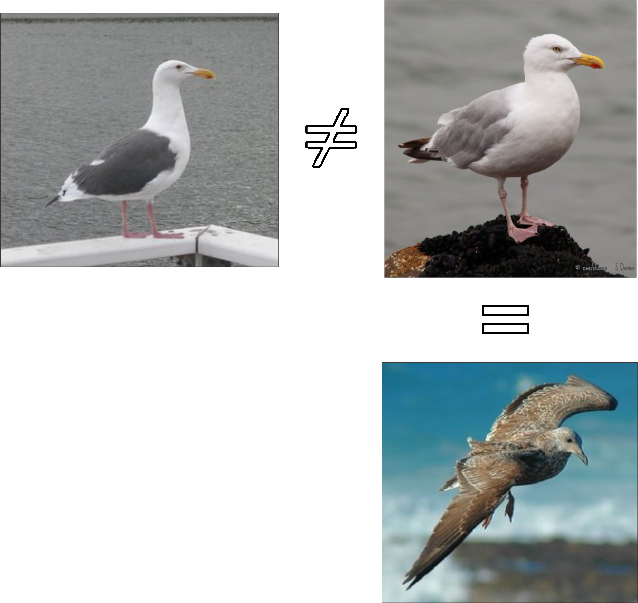
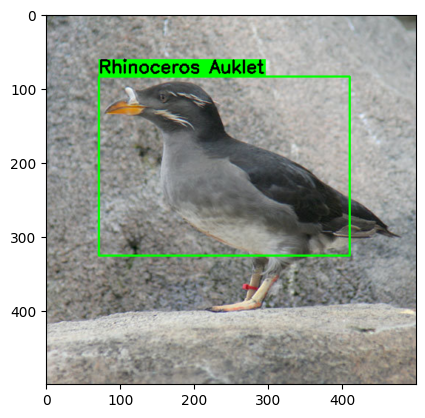
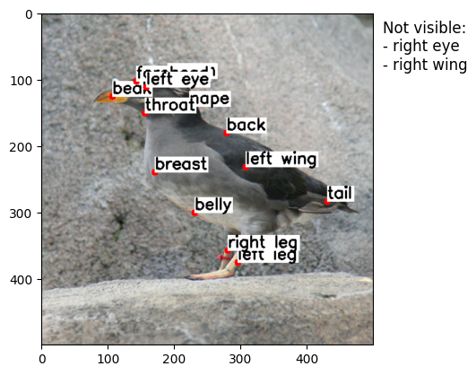
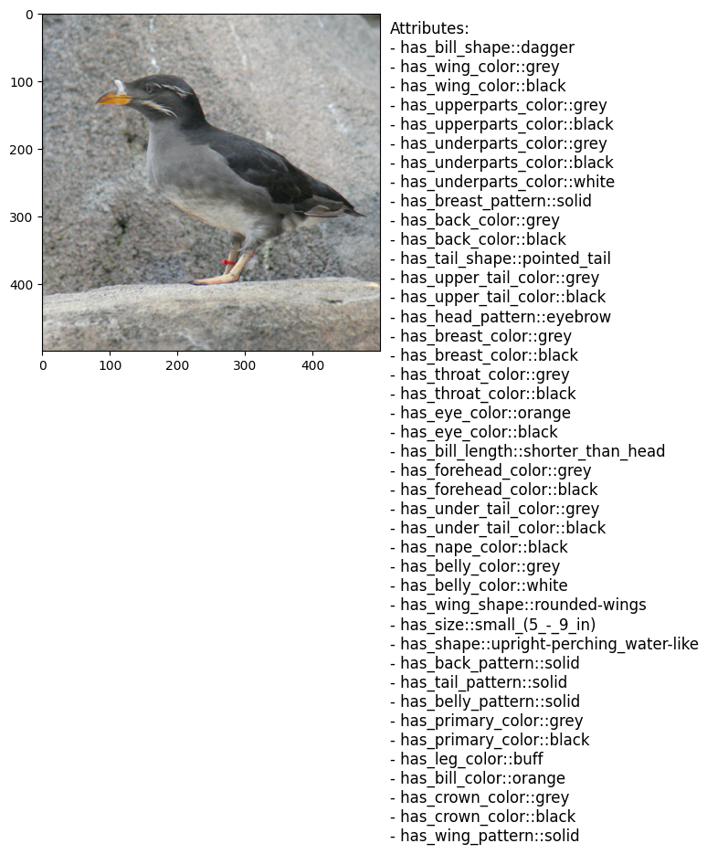

## Overview
Final Project for the Applied Artificial Intelligence course at McMaster University

Our bird classification exploration is organized into two distinct folders, each dedicated to a specific dataset: [20_UK_Garden_Birds](https://www.kaggle.com/datasets/davemahony/20-uk-garden-birds) and [Caltech-UCSD Birds-200-2011](https://www.vision.caltech.edu/datasets/cub_200_2011/)

The first dataset includes 20 species of UK garden birds. We experimented with various methods incrementally. We began with a simple Convolutional Neural Network (CNN), followed by fine-tuning using ResNet50 and a Vision Transformer (ViT). This work was conducted as part of the course's final project.

The second dataset extends the first project to explore Fine-Grained Classification. This type of classification involves distinguishing between visually similar categories, which is challenging due to subtle inter-class differences and significant intra-class variations, as illustrated below:

The focus is on exploring multiple ideas that leverage different aspects of deep learning and computer vision to improve classification accuracy. While the work is ongoing, this README provides an overview of the key ideas being explored. If you are already familiar with the dataset, you can jump to the [Research Directions](#research-directions) section.

### Presentation of the Dataset
As described on the [Caltech Vision Lab's page](https://www.vision.caltech.edu/datasets/cub_200_2011/) for the Caltech-UCSD Birds-200-2011 dataset:
"Caltech-UCSD Birds-200-2011 (CUB-200-2011) is an extended version of the CUB-200 dataset, with roughly double the number of images per class and new part location annotations.

Number of categories: 200
Number of images: 11,788
Annotations per image: 15 Part Locations, 312 Binary Attributes, 1 Bounding Box"

Here is an example of the contents of the dataset for the image `008.Rhinoceros_Auklet/Rhinoceros_Auklet_0050_797534.jpg`

- Bounding Box:

- 15 Body Parts:

- Attributes (only the visible ones out of the 312):

### Research Directions
To ensure that bird watchers, conservationists, and ornithologists can easily use the system, we aim to utilize only images as input. To tackle this problem, we will explore the following approaches:

##### 1. Multi-Modal Fusion
Combine multiple sources of information to enrich feature representations for better classification. The initial idea for the visual feature extraction component was to use a Swin Transformer, as its architecture is theoretically more suitable for fine-grained classification compared to a standard Vision Transformer (ViT). However, initial tests using the `microsoft/swin-tiny-patch4-window7-224` version showed that this model, with its 27.7 million parameters, took too long to fine-tune on the author's computer. Although 27 million parameters isn't excessively large, further testing may be required to make it feasible. The general idea is as follows:

- Visual Feature Extraction with Vision Transformer (ViT) (Fine-Tuning)
- Attribute Extraction with Convolutional Neural Network (CNN): Train a CNN for multi-label classification to predict bird attributes.
- Pose Estimation Features: Extract geometric features such as body part presence, distances, and angles between parts.

Subsequently, we will fuse the features from ViT, CNN, and pose estimation, either by concatenation or stacking.

We will first start by using a Separate Training strategy: training each component individually, freezing their weights, and then training the classification layers. This will reduce the computational intensity compared to end-to-end training but may result in suboptimal performances.

We have identified a few challenges with this approach, including its computationally intensive nature and the potential for overfitting. Data augmentation may be somewhat difficult, as it would require modifying body part positions and rotations accordingly. Further, a potential modality imbalance could be an issue as well.

##### 2. Multi-Task Learning
This approach involves simultaneously learning the three aforementioned tasks via a shared backbone network. By encouraging the backbone to extract features useful across multiple tasks, we expect to see better generalization than from single-task learning. However, it is important to note that sometimes optimizing for one task may negatively impact another, and one task could dominate training due to larger gradients. Nonetheless, the tasks can complement each other; for example, knowing the pose can aid in species classification.

##### 3. Modeling Relationships with Graph Convolutional Network (GCNs)
A Graph Convolutional Network (GCN) is used to learn from a graph representation of the bird image, where nodes represent body parts and edges their relationships (adjacency).

#### 4. Coarse-to-Fine Hierarchical Classification
*if time and interest permit* 
This approach involves a hierarchical classification process, where a first model predicts the bird family, and a second model predicts the species within that family. By breaking down the classification task into two stages, we expect to see improved accuracy, especially for species that are difficult to distinguish. Additionally, this approach can reduce the complexity of the classification task, as the first model only needs to learn to distinguish between families, rather than individual species. However, this approach also introduces additional complexity, as separate models need to be trained. Furthermore, errors in the first stage can propagate to the second stage, leading to incorrect species classification.

*Note: This README provides a conceptual overview. Detailed implementations and results will be added as the project progresses.*